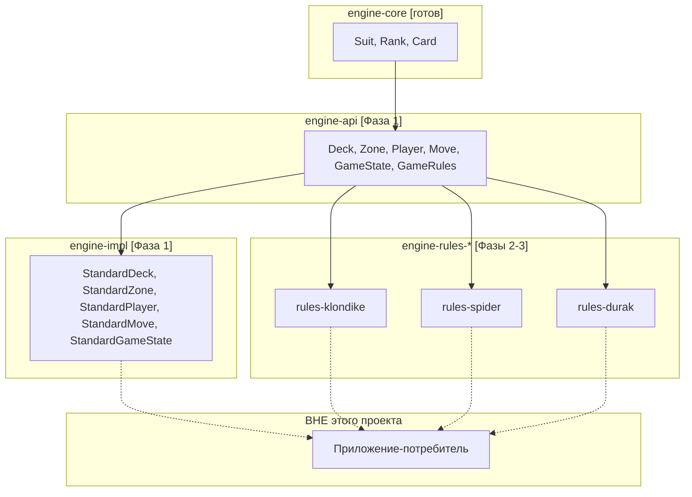
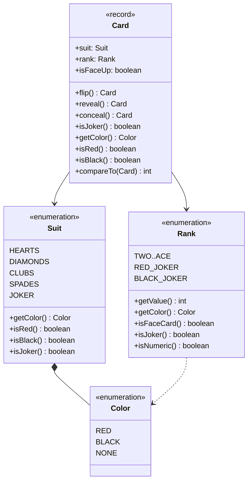
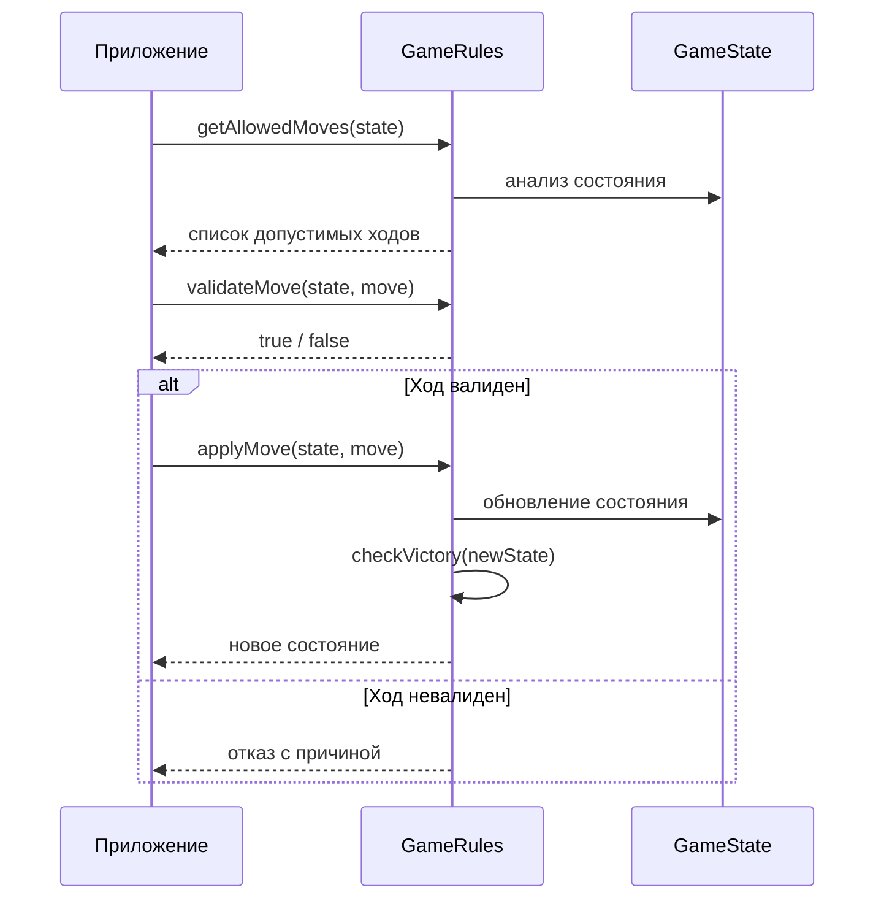
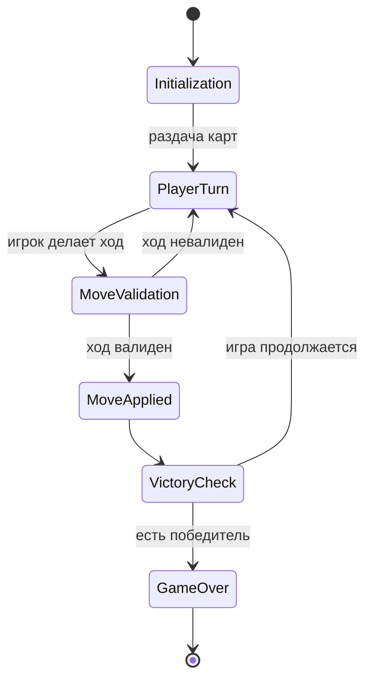

# Архитектура Card Game Engine

## 🎯 Статус проекта: БИБЛИОТЕКА

Этот проект — **библиотека**, а не приложение. Мы предоставляем переиспользуемый
движок для создания карточных игр. Конечные приложения (консольное, веб, мобильное)
будут созданы в **отдельных проектах-потребителях**.

| Аспект           | Наша библиотека  | Приложение-потребитель |
|------------------|------------------|------------------------|
| Точка входа      | Нет `main()`     | Есть `main()`          |
| Пользователь     | Разработчик      | Игрок                  |
| Стабильность API | Критически важна | Не важна               |
| Версионирование  | SemVer           | Внутреннее             |

Подробнее: [ADR-001: Почему библиотека](decisions/001-why-library.md)

## 🏗️ Принципы архитектуры

1. **Зависимости направлены только вниз**: `rules-*` → `api` → `core`
2. **Модули правил зависят только от `api`**, никогда от `impl`
3. **Все сущности неизменяемы** для потокобезопасности ([ADR-004](decisions/004-immutable-cards.md))
4. **Полная согласованность контрактов** `java.lang` ([ADR-003](decisions/003-comparable-contract.md))
5. **Правила игр не живут в ядре** — ядро только хранит и сортирует

## 🧱 Модули

| Модуль                  | Назначение                                                             | Статус          |
|-------------------------|------------------------------------------------------------------------|-----------------|
| `engine-core`           | Базовые сущности: `Suit`, `Rank`, `Card`                               | ✅ Готов        |
| `engine-api`            | Интерфейсы: `Deck`, `Zone`, `Player`, `Move`, `GameState`, `GameRules` | 🔜 В разработке |
| `engine-impl`           | Стандартная реализация интерфейсов                                     | ⏳              |
| `engine-rules-klondike` | Правила Клондайка (Косынки)                                            | ⏳              |
| `engine-rules-spider`   | Правила Паука                                                          | ⏳              |
| `engine-rules-durak`    | Правила Дурака                                                         | ⏳              |

## 📐 Диаграммы

### 1. Структура модулей и зависимости

### 2. Классы engine-core

### 3. Последовательность хода

### 4. Жизненный цикл игры

## ⚙️ Нефункциональные требования

- **Потокобезопасность**: все сущности иммутабельны, библиотеку можно использовать из нескольких потоков
- **Производительность**: операции над картами — O(1), тасование колоды — O(n)
- **Совместимость**: минимум Java 25 (LTS)
- **Отсутствие зависимостей**: ядро не зависит от сторонних библиотек (только стандартная библиотека Java)
- **Документация**: все публичные классы и методы имеют Javadoc

## 🃏 Поддерживаемые колоды
| Колода      | Карты      | Игры                  | Джокеры          |
|-------------|------------|-----------------------|------------------|
| Малая       | 24 (9–Туз) | Дурак                 | Опционально      |
| Стандартная | 24 (9–Туз) | Дурак                 | Опционально      |
| Полная      | 24 (9–Туз) | Клондайк, Паук, Дурак | Нет              |
| С джокерами | 24 (9–Туз) | Дурак                 | Красный + Чёрный |

Подробнее про дизайн джокеров: [ADR-002](decisions/002-joker-design.md)